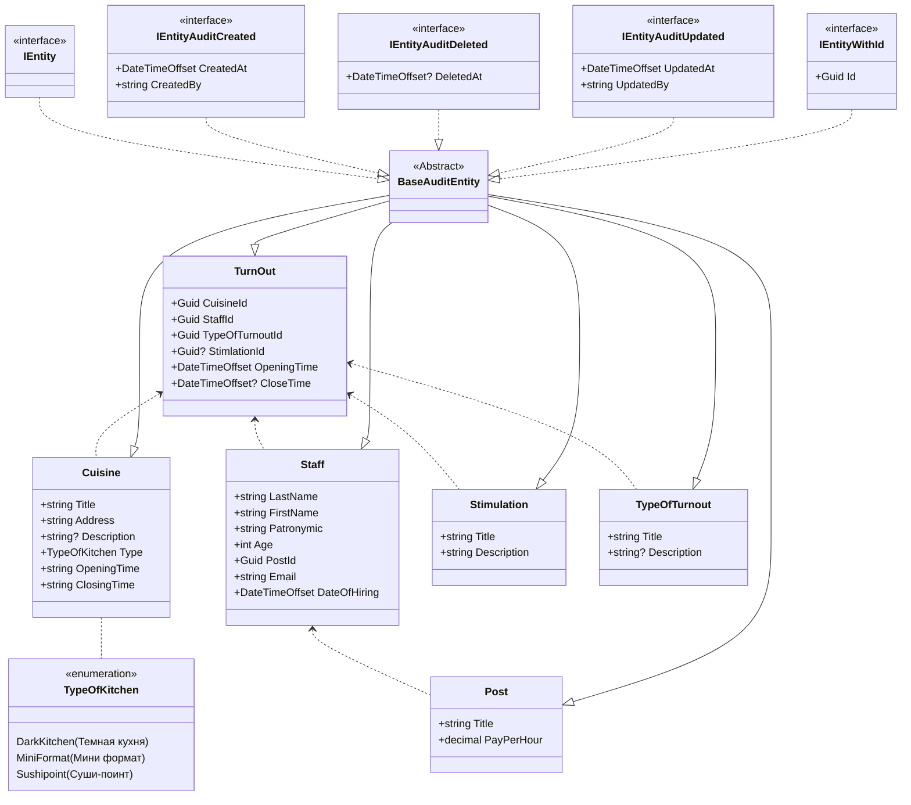

Описание предметной области
---
Автоматизация процесса учета рабочего времени сотрудников.

Автор
---
Шатохин Александр студент группы ИП 20-3

Схема моделей
---

Пример реального бизнес сценария
---

SQL скрипт
---
```
```
