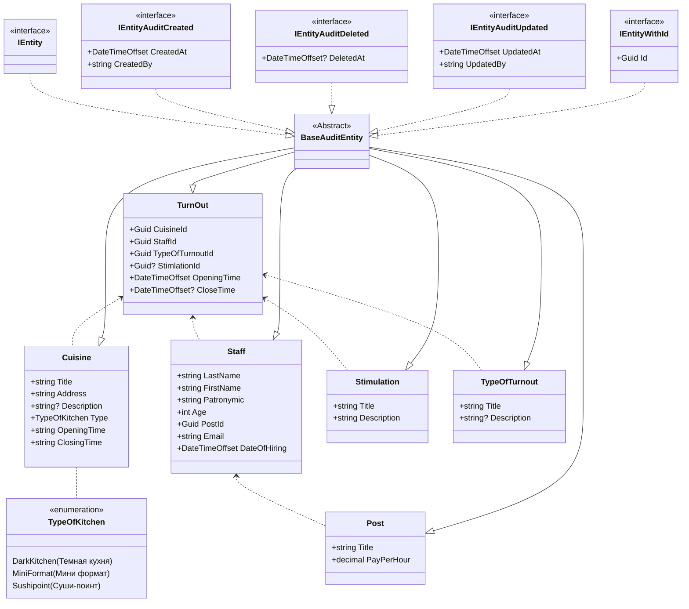

Описание предметной области
---
Автоматизация процесса учета рабочего времени сотрудников.

Автор
---
Шатохин Александр студент группы ИП 20-3

Схема моделей
---

Пример реального бизнес сценария
---


SQL скрипт
---
```
USE KitchenDB

INSERT INTO [dbo].[Posts]
           ([Id]
           ,[Title]
           ,[PayPerHour]
           ,[CreatedAt]
           ,[CreatedBy]
           ,[UpdatedAt]
           ,[UpdatedBy]
           ,[DeletedAt])
     VALUES
           ('95909b04-8695-462f-abf9-f21d7953435f'
           ,N'Повар'
           ,300
           ,GETDATE()
           ,'Insert'
           ,GETDATE()
           ,'Insert'
           ,null),
	   ('8b84d98b-5c5d-4c54-84ae-ee94e99cc297'
           ,N'Су-шеф'
           ,500
           ,GETDATE()
           ,'Insert'
           ,GETDATE()
           ,'Insert'
           ,null)

INSERT INTO [dbo].[Stimulations]
           ([Id]
           ,[Title]
           ,[Description]
           ,[CreatedAt]
           ,[CreatedBy]
           ,[UpdatedAt]
           ,[UpdatedBy]
           ,[DeletedAt])
     VALUES
           ('c488258b-c78a-44b4-8d9e-dd5a594c03a3'
           ,'Переработка'
           ,'10% от каждого заказа'
           ,GETDATE()
           ,'Insert'
           ,GETDATE()
           ,'Insert'
           ,null),
	   ('71e62fbe-6074-42ea-8cf2-a6e7a4a0406d'
           ,'Доп. плата'
           ,'10 рублей в часу'
           ,GETDATE()
           ,'Insert'
           ,GETDATE()
           ,'Insert'
           ,null)

INSERT INTO [dbo].[TypeOfTurnouts]
           ([Id]
           ,[Title]
           ,[Description]
           ,[CreatedAt]
           ,[CreatedBy]
           ,[UpdatedAt]
           ,[UpdatedBy]
           ,[DeletedAt])
     VALUES
           ('30471955-3880-4bf7-b6a7-a3ed842ba193'
           ,'По расписанию'
           ,null
           ,GETDATE()
           ,'Insert'
           ,GETDATE()
           ,'Insert'
           ,null),
           ('81d5d1c6-f068-46bf-81af-b7e43222a97d'
           ,'Замена'
           ,'Только исходя из графика'
           ,GETDATE()
           ,'Insert'
           ,GETDATE()
           ,'Insert'
           ,null)

INSERT INTO [dbo].[Staffs]
           ([Id]
           ,[FirstName]
           ,[LastName]
           ,[Patronymic]
           ,[PostId]
           ,[Age]
           ,[Email]
           ,[DateOfHiring]
           ,[CreatedAt]
           ,[CreatedBy]
           ,[UpdatedAt]
           ,[UpdatedBy]
           ,[DeletedAt])
     VALUES
           ('bfdad875-4499-49c5-80db-bf65c4e98b3d'
           ,'Кирилл'
           ,'Коротков'
           ,'Александрович'
           ,'95909b04-8695-462f-abf9-f21d7953435f'
           ,'25'
           ,'test@gmail.com'
           ,'01.01.2023'
           ,GETDATE()
           ,'Insert'
           ,GETDATE()
           ,'Insert'
           ,null),
 	   ('ea0fa83f-9423-40ac-94b0-43b70fad3108'
           ,'Дмитрий'
           ,'Панов'
           ,'Алексеевич'
           ,'8b84d98b-5c5d-4c54-84ae-ee94e99cc297'
           ,'27'
           ,'insert@gmail.com'
           ,'01.01.2023'
           ,GETDATE()
           ,'Insert'
           ,GETDATE()
           ,'Insert'
           ,null)

INSERT INTO [dbo].[Cuisines]
           ([Id]
           ,[Title]
           ,[Address]
           ,[Description]
           ,[Type]
           ,[OpeningTime]
           ,[ClosingTime]
           ,[CreatedAt]
           ,[CreatedBy]
           ,[UpdatedAt]
           ,[UpdatedBy]
           ,[DeletedAt])
     VALUES
           ('549fd5ce-4391-448c-a57c-b3efd89612ac'
           ,'Название'
           ,'Адрес'
           ,'Очень вкусно'
           ,0
           ,'12:00'
           ,'22:00'
           ,GETDATE()
           ,'Insert'
           ,GETDATE()
           ,'Insert'
           ,null),
	   ('f8aa95f7-7748-41f9-a439-e264ac5225bc'
           ,'Название2'
           ,'Адрес2'
           ,'Очень вкусно2'
           ,1
           ,'10:00'
           ,'18:00'
           ,GETDATE()
           ,'Insert'
           ,GETDATE()
           ,'Insert'
           ,null)

INSERT INTO [dbo].[TurnOuts]
           ([Id]
           ,[CuisineId]
           ,[StaffId]
           ,[StimlationId]
           ,[TypeOfTurnoutId]
           ,[OpeningTime]
           ,[CloseTime]
           ,[CreatedAt]
           ,[CreatedBy]
           ,[UpdatedAt]
           ,[UpdatedBy]
           ,[DeletedAt])
     VALUES
           ('cec710aa-bb98-4459-be92-e281b57ac460'
           ,'549fd5ce-4391-448c-a57c-b3efd89612ac'
           ,'bfdad875-4499-49c5-80db-bf65c4e98b3d'
           ,null
           ,'30471955-3880-4bf7-b6a7-a3ed842ba193'
           ,'01.01.2023'
           ,'02.01.2023'
           ,GETDATE()
           ,'Insert'
           ,GETDATE()
           ,'Insert'
           ,null),
	   ('5828d8f4-51ae-4644-b5f1-0dc0e7aba1ac'
           ,'f8aa95f7-7748-41f9-a439-e264ac5225bc'
           ,'ea0fa83f-9423-40ac-94b0-43b70fad3108'
           ,'c488258b-c78a-44b4-8d9e-dd5a594c03a3'
           ,'81d5d1c6-f068-46bf-81af-b7e43222a97d'
           ,'03.01.2023'
           ,'04.01.2023'
           ,GETDATE()
           ,'Insert'
           ,GETDATE()
           ,'Insert'
           ,null)
```
